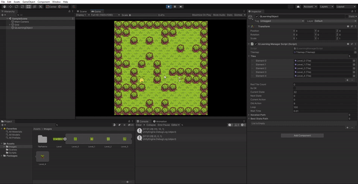

# UnityBeeFindingFlowerWithQLearning - Unity Uygulaması

## Herkese Selamlar

Bu proje, Unity ve **makine öğrenmesi** yöntemlerinden **pekiştirmeli öğrenme (reinforcement learning)** metodu olan **Q-Learning** algoritmasıyla kodladığım "En kısa yolu bulma" projem. 

Bu projeyi yapmamdaki amaç; Unity ile yapılan oyunlarda botların AI'larında bu algoritmayı kullanmayı deneyerek verimliliğini test etmekti.

Uygulama içerisinde 10x10'luk bir alana manual yerleştirilen bir GameObject'ye, yine manual yerleştirilen varış noktasına engellere çarpmadan gidilebilecek en kısa yolu buldurmak istedim. Sonuç olarak böyle bir proje ortaya çıktı.

## İçindekiler

0. [Herkese Selamlar](#herkese-selamlar)
1. [Uygulama Hakkında](#uygulama-hakkında)
2. [Yüklenmesi Gereken Kütüphaneler](#yuklenmesi-gereken-kutuphaneler)
3. [Eklenecek veya Düzenlenecek Kısımlar](#eklenecek-veya-duzenlenecek-kısımlar)
4. [Youtube Linki](#youtube-linki)

## Uygulama Hakkında

Q-Learning'de amaç, maksimum değeri bularak ayrı bir dizi eylemden tek bir deterministik eylemi öğrenmektir. 

Bu projede 8 eylemimiz var ve bunlar sağ, sol, yukarı, aşağı, sağ çapraz, sağ çapraz, sol çapraz, sol çapraz. Harita üzerinde 100 state bulunmakta. Arılar çalılara(engellere) giderse -10 puan, arılar çimenlere(gidilebilir bölge) giderse 0(sıfır) puan, arılar çiçeklere(varış noktası) giderse +10 puan alır. Kullandığım formül: Q(s,a) = R(s,a) + γ×Max{Q(s′,a′)}. Oyun başladığında arılar çalılara gitmeden çiçekleri bulmaya çalışır. Bu eylem 100 kez tekrar eder. Arılar çalıya giderse konumu tekrar başlangıç ​​pozisyonunda olacaktır.

Oyun başlatıldığında içerisinde çalılar ve çimenler olan random bir harita oluşturulur. 

Mouse-1 tuşuna basıldığında hedefi bulacak olan GameObject yerleştirilir.

Mouse-2 tuşuna basıldığında varış noktası yerleştirilir.

Mouse-3 tuşuna basıldığında haritaya engel eklenir veya kaldırılır.

Nesneleri yerleştirme işlemini bitirdikten sonra **space** tuşuna basıldığında algoritma çalışmaya başlar. 

## Eklenecek veya Duzenlenecek Kısımlar

- GameObject varış noktasını ararken harita görsellerinde bazen engel siliniyor. Bu durumun en kısa yolu bulurken bir hataya sebep olmadığı tespit edildi. Sadece görsel olarak engel görseli olması gereken yerde boş arazi görseli gözüküyor. Bu görsel sorun düzeltilecek.

## Youtube Linki

Youtube üzerinden paylaştığım uygulama videosuna [bu linkten](https://youtu.be/NMCGep4w5po) ulaşabilirsiniz.
